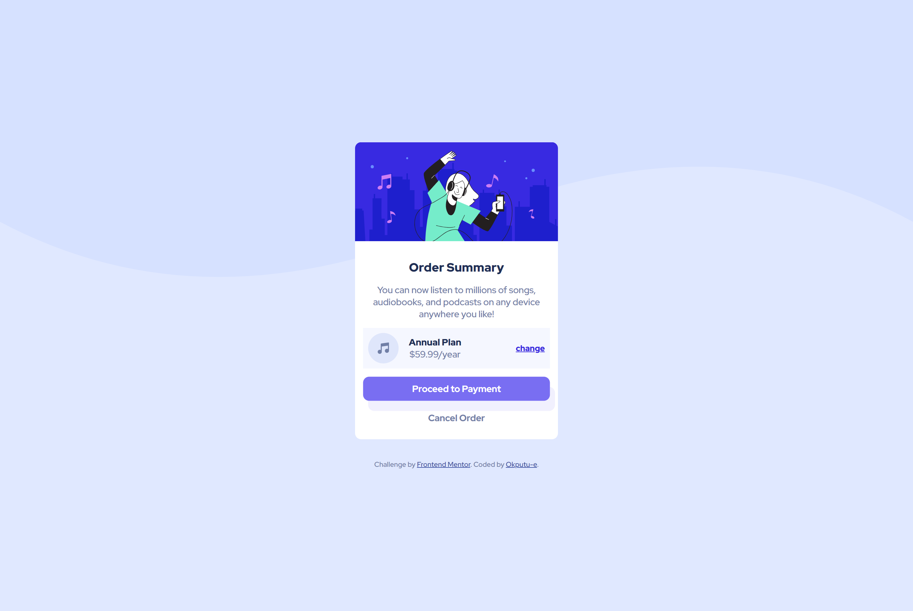
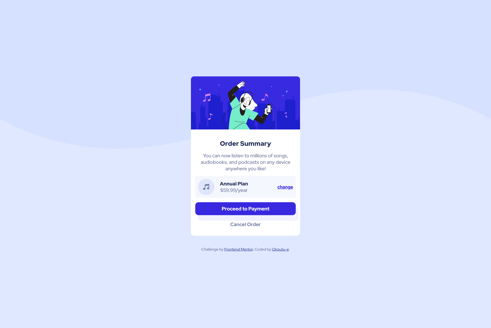

# Frontend Mentor - Order summary card solution

This is a solution to the [Order summary card challenge on Frontend Mentor](https://www.frontendmentor.io/challenges/order-summary-component-QlPmajDUj). Frontend Mentor challenges help you improve your coding skills by building realistic projects.

## Table of contents

- [Overview](#overview)
  - [The challenge](#the-challenge)
  - [Screenshot](#screenshot)
  - [Links](#links)
- [My process](#my-process)
  - [Built with](#built-with)
  - [What I learned](#what-i-learned)
  - [Useful resources](#useful-resources)
- [Author](#author)

## Overview

### The challenge

Below are the screenshots to my solution

### Screenshots

- hover state
  

-desktop version


- mobile version
  

### Links

- Solution URL: [Add solution URL here](https://github.com/okputu-e/Order_summary_card)
- Live Site URL: [Add live site URL here](https://your-live-site-url.com)

## My process

### Built with

- Semantic HTML5 markup
- CSS custom properties
- Flexbox
- Mobile-first workflow

### What I learned

The project helped me learn more about CSS3. I normally prefered adding background images using img tags and styling them appropraitely.

However, I used the ::before on the body tag to solve that problem. Thus, I removed the img tags then used

- instead of this

```html


```

-I used this

```css
body::before {
  content: "";
  background-image: url("images/pattern-background-desktop.svg");
  background-repeat: no-repeat;
  position: absolute;
  top: 0;
  left: 0;
  width: 100%;
  height: 100%;
  z-index: -100;
  overflow: hidden;
}

@media (min-width: 1441px) {
  body::before {
    background-image: none;
  }
}
```

## Author

- Frontend Mentor - [@okputu-e](https://www.frontendmentor.io/profile/yourusername)
- Twitter - [@okputu_e](https://www.twitter.com/yourusername)
